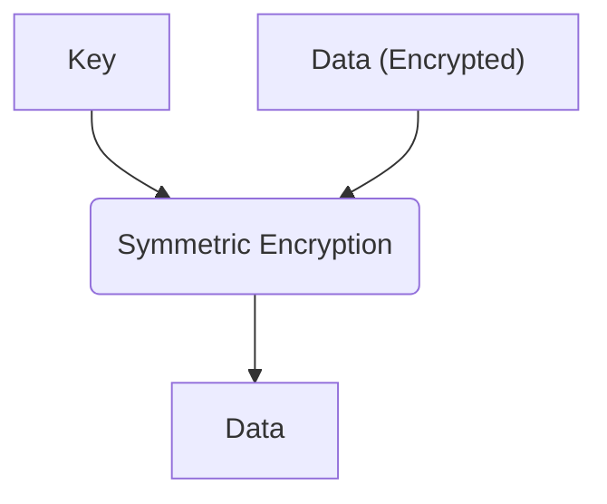
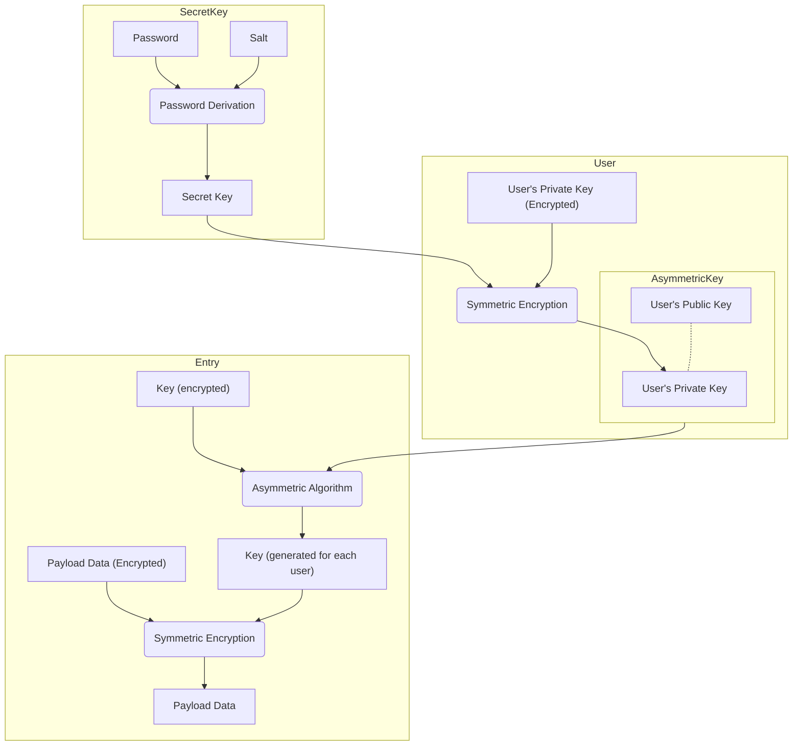

# Multi-Key Wallet

Securely encrypt you secrets for multiple users.

## Features

- Manage secrets through officially-signed command-line or GUI utilities.
- Collaborate with your team.

## Internal Design

This article explains the internal design of the database, and cryptographic
details used to make your data secure.

### Diagram

This diagram visually shows the whole design of the database in terms of
encryption.  The arrows show the sequence of decryption.

For example, in the following diagram:...

The 'Data' is asymmetrically encrypted using 'Key', and stored in 'Data
(Encrypted)'.  In other words, to decrypt data, 'Key' and 'Data (Encrypted)'
are required.

### Secret key

Secret key is a buffer of bytes, used to encrypt user's secret section.  The
users provide it to unlock the database.  If the secret key is lost, the
database will not open anymore.

In the current implementation, the user's secret key is a derivation of their
password.  In future versions, other kinds of key provider may be implemented,
for example, Windows user account or file sourcing.

In version '0' it's determined using PBKDF2 algorithm with random salt of the
length of 16 bytes and 100'000 iterations of password derivation.  The salt is
stored in the public section of the user.

The password derivation is suppose to take some time to prevent brute-force
attack.

### Users

Each user is defined in the database file, and consists public and secret
sections.  The secret section is encrypted symmetrically using user's secret
key, which they enter each time they open database.  Currently, the secret
section encrypts only the private key.

The public key is considered as cryptographic identifier of the user.  The
other users can sign this key to proof their trust.  It's stored publicly,
without any encryption, so everyone can verify the user and encrypt data
for them.

Every time the user authenticate the database, entering their secret key,
the secret section is being decrypted.  It cannot be changed by the potential
attacker, because they must know the secret key, otherwise, the user would
not be able to authenticate the database using their secret key.

After the user decrypts their secret section, they should verify the rest:

- Verify public key;  The attacker could have potentially modified the public
  key.  For each asymmetric private key, only a single public key can be
  generated, meaning that it enough to generate a new one and compare the
  one in the database and newly created.  In case of a mismatch, the operation
  will failed.

- Verify admin;  The admin is signed by each user's asymmetric credentials,
  which protects from a situation in which the attacker generates new admin
  credentials and modifies trust.  If admin's signature does not match, the
  operation should be rejected.

- Determine a list of trusted users;  The admin contain a list of asymmetric
  signatures, done by their private key, and the target being the public keys
  of the trusted users.  Since each public key is available for everyone,
  the verification is done anonymously (without requiring private key)

### Admin (The Master User, or just the owner)

Basically, the admin is just a regular user, with the same cryptographic
properties, but with several extra permissions.

- The admin uses the same concepts for secret key.
- The secret key is required to access secret data and perform admin operations.
- The admin utilises the same principals to securely encrypt a set of private
  and public asymmetric keys, except they have no need to verify themselves as
  admin.
- The secret entries are encoded for admin as well.

The main role of the admin is to verify other users.  Since anyone can promote
themselves as users, attackers may take advantage of this by hoping someone
will create a new secret entry, and encode it for them as well.

In order to prevent this kind of attack, the admin asymmetrically signs each
user using their (encrypted in the database) private key.

### Entries

The secret entries are encrypted using symmetric algorithm in the first place.
The key is generated each time the entries are being updated.  Then, it is
asymmetrically encrypted for each user the entry suppose to be shared to using
their public credentials.  

Encrypted entries store the following data in the database:

- Symmetrically encrypted data.
- Asymmetrically encrypted symmetric key for data.  This key is encrypted for
  each user separately.

To decrypt data, the user will first need to determine their private key and
verify the whole database as explained in [Users](#users).  Using their
private key, the user will asymmetrically decrypt the data key. Then, using
a symmetric algorithm decrypt the data itself.

Note: the entries are encrypt for a specific set of users, meaning they could
be hidden for some users.  Usually, they will encrypt secrets for all trusted
users, but, technically, they could manually choose who to share data with.

### Cryptography

Version `0` uses the following set of cryptographic algorithms:

- Password Derivation: **PBKDF2** (C# `Rfc2898DeriveBytes.Pbkdf2()`)
- Symmetric transformations: **AES** (C# `Aes.Create()`)
- Asymmetric transformations: **RSA** with **PKCS #1** padding (C# `RSA.Create()`)
- Hash algorithm: **SHA256**

### Storage

- Since 0.1.0 the only storage implementation is JSON-encoded single-file database.

TODO: discuss format?

In future versions, more reliable formats will be designed.

### API

TODO: section under construction
